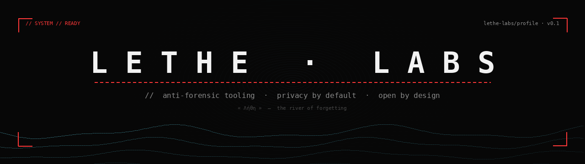

<div align="center">



</div>

---

> *In the underworld, **Lethe** was the river of forgetting. Those who drank from it lost all memory of their past.*
> *I build tools that let you choose what stays.*

---

## What I work on

Privacy and security tooling for Android. Defensive systems for users at risk:
journalists, activists, dissidents, survivors of harassment and domestic abuse,
whistleblowers, and anyone who needs **provable data sovereignty** on their device.

Everything I publish is:

- 🔓 **Open source** (AGPL-3.0 or compatible)
- 📵 **100% offline** — no telemetry, no analytics, no cloud
- 🔑 **Hardware-backed crypto** wherever the platform allows it
- 📝 **PGP-signed** commits

---

## Current projects

### 🔻 [oblivion-v2](https://github.com/lethe-labs/oblivion-v2) — Anti-forensic duress-wipe for Android

Seven independent triggers (lockscreen guard, USB kill, SMS, voice, dead man's switch,
scheduled wipe, decoy mode) wired to `DevicePolicyManager.wipeData()`. AGPL-3.0.
Compatible Android 10 → 14+.

The signature feature is **Decoy Mode**: a fake "System Update" full-screen
notification displayed over the lock screen while the wipe runs silently behind.
The attacker waits. The device disappears.

---

## Principles

```
1. Code is speech. Speech is protected.
2. Trust no server you don't control.
3. Defaults matter more than features.
4. Document your threat model.
5. Open beats clever.
```

---

## Contact

- 📩 **Mail**: `lethe-labs@protonmail.com`
- 🔑 **PGP fingerprint**: `FB1A B1B0 40C1 55C9 3723  FE6C 9009 E2FD E83B 92DB`
- 🔐 **Security disclosures**: see [SECURITY.md](https://github.com/lethe-labs/oblivion-v2/blob/main/SECURITY.md) on any of my repos

Always sign your message. I will not respond to unsigned security reports.

---

<div align="center">

*Aucune donnée ne quitte jamais l'appareil.*<br>
*No data ever leaves the device.*

</div>
